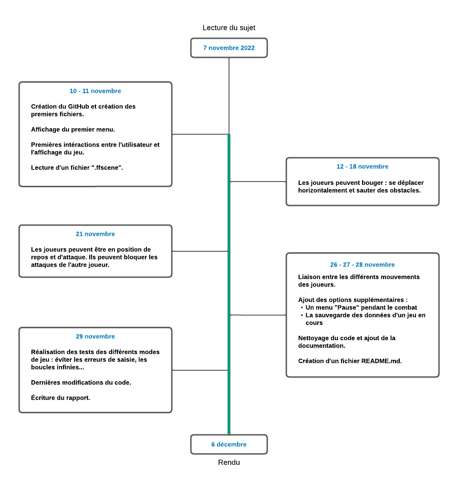

# Projet PA 2022 : Fencing game


## Sommaire
1. [Introduction et informations](README.md#introduction-et-informations)
2. [Fonctionnalités](README.md#fonctionnalités)
3. [Compilation, exécution et arguments possibles](README.md#compilation-execution-et-arguments-possibles)
4. [Organisation de travail](README.md#organisation-de-travail)

-------------------------------------------------------


## Introduction et informations
**Informations généraux**
- Le sujet du projet : [projet.pdf](https://github.com/eio-ta/project-pa/blob/main/Project.pdf)

**Identifiants et membres du groupe**
1. TANG Elody, 21953199


## Fonctionnalités

Ce projet est basé sur un jeu simple d'escrime. Dans ce jeu, un joueur peut marquer des points en entrant en contact avec l'adversaire grâce à son épée.


**Fonctionnalités principales :**

1. Le programme est capable de permettre à deux joueurs locaux de jouer au jeu avec un écran de terminal.
2. Le nombre d'images par seconde est modifiable avec une option.
3. Le jeu se déroule dans une scène qui peut être modifiée par le joueur par l'intermédiaire de fichiers. La scène peut être uniquement lu avec l'extension `.ffscene`. Le fichier doit contenir une ligne avec les caractères suivants : `1` (le premier joueur), `2` (le deuxième joueurs), `_` (le sol) et `x` (un obstacle).
4. Chaque joueur possède les attributs suivants : `movement_speed` (vitesse de mouvement), `attacking_speed` (vitesse d'attaque), `attacking_range` (portée d'attaque), `defending_range` (portée de défense) et `block_time` (durée du blocage) et effectue ses mouvements en fonction de ses attributs.
5. Pendant un combat, le joueur peut :
    - se déplacer vers la gauche.
    - se déplacer vers la droite.
    - sauter par dessus un obstacle vers la droite.
    - sauter par dessus un obstacle vers la gauche.
    - attaquer.
    - bloquer une attaque.

| Déplacements                   | Joueur 1  | Joueur 2  |
| ------------------------------ | --------- | --------- |
| se déplacer vers la droite     | d         | →         |
| se déplacer vers la gauche     | q         | ←         |
| sauter vers la droite          | e         | l         |
| sauter vers la gauche          | a         | m         |
| attaquer                       | z         | o         |
| bloquer les attaques           | s         | p         |


**Fonctionnalités secondaires :**

1. Un menu simple d'accès a été ajouté pour pouvoir choisir les paramètres de son jeu.
2. Un mode de jeu simple (avec le choix d'une scène par défaut) a été rajoutée.
3. Une partie s'arrête au moment où l'un des joueurs a atteint trois points.
4. À la fin du jeu, les joueurs peuvent décider de recommencer une partie avec les mêmes paramètres ou de revenir sur le menu.
5. Au début du jeu, le joueur peut choisir le nombre d'images par seconde avec une option sur la ligne de commande.
6. Durant une partie, le joueur peut mettre le jeu en pause en cliquant sur `' '`. Il peut ainsi reprendre la partie en cours **ou** revenir sur la page du menu.
7. Si les deux joueurs veulent quitter une partie en cours, ils peuvent sauvegarder la partie et rejouer plus tard.
8. Les joueurs ont plusieurs choix possibles pour choisir leur scène de combat : soit avec le trasnfert de données avec un fichier, soit avec le menu.


## Compilation execution et arguments possibles


**Compilation et éxécution**

Il existe une méthode simple pour compiler et exécuter le programme "Fencing game" :
- `make` sans argument lancera la compilation du jeu.
- `./main <ARG1>` lancera le programme avec l'argument utilisé.
- `make clean` pour effacer les fichiers produits par `make` lors de sa compilation.


**Les arguments possibles lors de l'exécution**

**Pour `ARG1`**

Il suffit de mettre un `[CHIFFRE]` pour ajouter le nombre d'images par secondes. Si l'utilisateur choisit d'éxécuter le code avec la commande ci-dessous, alors le nombre d'images par secondes est de 12 par défaut.

```
./main
```


## Organisation de travail


**Brève chronologie du travail effectué**

